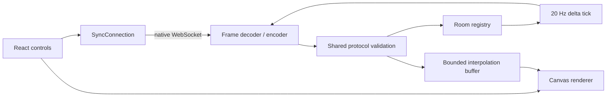

# Architecture

## Ownership

The transport layer knows bytes, masking, fragmentation, ping/pong, close, rate limiting, and backpressure. The protocol layer knows only typed message shapes and validation. A room owns participant identity, slots, the latest cursor, per-connection sequence ordering, reaction combos, and fan-out. The renderer owns no network behavior; it consumes validated server messages.

## Message lanes

- `hello`: first client frame; includes protocol version, room ID, stable client ID, and display name.
- `welcome`: full presence snapshot and the recipient's slot. `resumed` indicates a reconnect.
- `join`, `status`, `leave`: presence changes.
- `cursor`: client input with `q`, `x`, and `y`; sent at most 30 Hz and only after meaningful movement.
- `state`: server tick with `k`, timestamp, and changed `[slot, x, y]` tuples.
- `reaction`: immediate discrete action with normalized position and a closed reaction-kind index.
- `combo`: server resolution when reactions land within 50 ms and 5% normalized distance.
- `ping` / `pong`: application RTT measurement, sampled into an RTT/jitter EMA and shown in the topbar; protocol WebSocket ping/pong separately supplies liveness.
- `error`: rejected input is explicit rather than silently ignored.

## Ordering and reconnect

TCP preserves order inside a connection, but reconnects can race a previous socket and clients can retry. Cursor sequence numbers restart per connection and are scoped by the server-owned peer record; replacing a live socket resets the sequence. State timestamps and tick counters are monotonic per room. A peer record remains for 5 seconds after a dropped socket, so the stable client ID maps back to the same slot and color without duplicates.

## Interpolation tradeoff

The renderer delays the cursor clock by at least 75 ms, buffers at most 24 samples, and linearly interpolates between samples surrounding the delayed time. Jitter expands the delay up to 300 ms. At the end of the buffer it extrapolates from the last velocity for 120 ms, then holds. This makes a degraded connection look continuous while bounding both visual latency and memory. The server never stores cursor history; it only retains the latest position.

## Scaling boundary

The single process uses one timer and one encoded frame per room tick, then writes that buffer to each socket. With multiple processes, room affinity or a broker would be required for presence and ordered relay. Persisting cursor history is intentionally out of scope.
